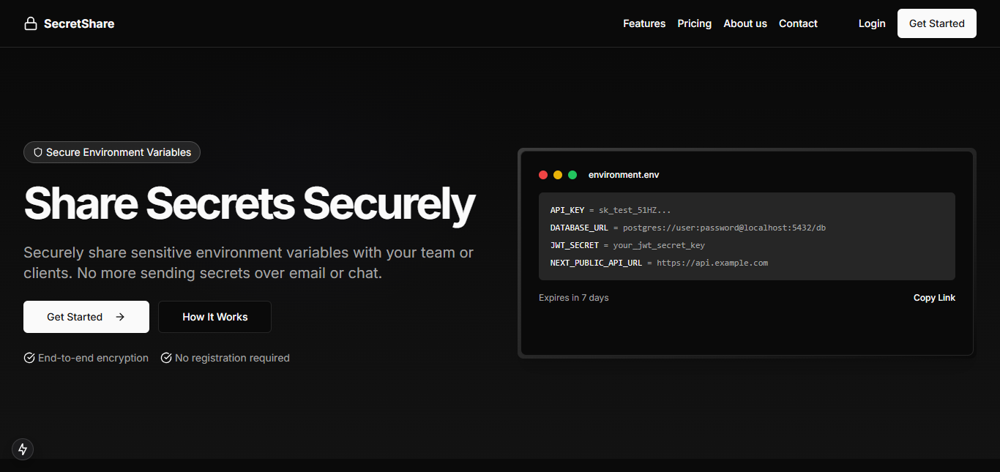

# SecretShare

SecretShare is a secure platform for sharing sensitive information with your team or clients. With end-to-end encryption and time-limited access, you can ensure your secrets remain secure.



## Features

- **End-to-End Encryption**: All secrets are encrypted in the browser before being sent to our servers
- **Time-Limited Access**: Set expiration times for your secrets
- **Secure Sharing**: Share secrets via secure links or directly with team members
- **Access Controls**: Define who can view your secrets and for how long
- **Audit Logs**: Track when and by whom your secrets were accessed
- **Dark Mode**: Easy on the eyes, day or night

## Getting Started

### Prerequisites

- Node.js 18.0.0 or higher
- npm or yarn

### Installation

1. Clone the repository:
   ```bash
   git clone https://github.com/yourusername/secret-share.git
   cd secret-share